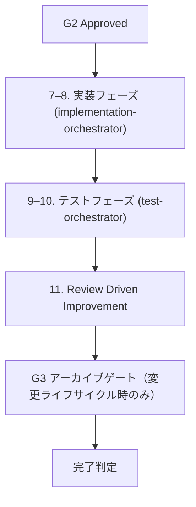

# OpenSpec G2 後実行ガイド

## 1. 目的

本書は、G2 Approved の直後に行う実装・テスト・改善の実行順、使う prompt と skill の分担、PLN/TST の委譲粒度、レビュー指摘の修正 Plan 化、差戻し判定、完了条件を定めるための運用ガイドである。

方針は次のとおりである。

- 実行規律は Superpowers の汎用 skill を優先して再利用する
- OpenSpec 固有の判定は workspace 側で補う
- post-G2 のエージェントは implementation-orchestrator と test-orchestrator が各フェーズ全体を調整し、implementation-executor / implementation-reviewer、test-executor / test-reviewer をサブエージェントとして内部で呼び出す
- post-G2 の skill は implementation-review、implementation-execution-feedback-handling、test-review、test-execution-feedback-handling を使う
- 改善分析は review-driven-improvement と review-improvement-analyst でまとめる

## 2. 適用範囲

本書は、[OpenSpec ワークフローにおける skill / prompt 呼び出し順手順書](openspec-workflow-call-order.md) の Step 6 で G2 Approved になった後から、実装レビュー、テストレビュー、および改善分析の要否判断までに適用する。

対象外は次のとおりである。

- Subsystem Spec / Detailed Design / G1 / G2 の作成やレビュー手順
- 既存の Superpowers 自体の実行方法の再定義
- レビュー結果の分類ロジックそのものの変更

## 3. 入口条件

このガイドは、次の条件をすべて満たしたときに開始する。

- G2 review が Approved である
- Implementation Plan と Test Plan が両方とも承認済みである
- REQ / DSG / PLN / TST の対応表が揃っている
- 実装・テストに進むための handoff が明示されている

入口条件を満たさない場合は、本書の Step 7 以降へ進まず、[OpenSpec ワークフローにおける skill / prompt 呼び出し順手順書](openspec-workflow-call-order.md) の Step 4 から Step 6 を再確認する。

## 4. 実行順

### Step 7–8. 実装フェーズ

- 主 prompt: implementation-orchestrator
- 主な役割: 実装フェーズ全体（execution → review → ループ）を調整する。implementation-executor と implementation-reviewer を内部でサブエージェントとして順次呼び出し、コードレベルの差戻しは自動的にループし、Design / Plan 差戻しはハンドオフで停止する
- 内部で呼び出すエージェント:
  - **implementation-executor**: PLN 単位の実装実行。PLN ごとに implementer → spec compliance reviewer → code quality reviewer の 3 段階サブエージェントをオーケストレーションし、最後に final code reviewer サブエージェントを派遣する
  - **implementation-reviewer**: 実装結果を承認済み Detailed Design と Implementation Plan に照らしてレビューし、戻し先を判定する
- 使う Superpowers skill（executor 経由）:
  - using-git-worktrees
  - test-driven-development
  - requesting-code-review
  - receiving-code-review
  - systematic-debugging
  - verification-before-completion
  - finishing-a-development-branch
- 使う workspace skill:
  - implementation-review
  - implementation-execution-feedback-handling
- 出力:
  - ループ回数と指摘サマリ
  - 最終 Implementation Review 結果（Approved / Rework）
  - test-orchestrator への handoff または Design / Plan 差戻しハンドオフ
  - PLN / REQ / DSG / REV traceability サマリ

### Step 9–10. テストフェーズ

- 主 prompt: test-orchestrator
- 主な役割: テストフェーズ全体（execution → review → ループ）を調整する。test-executor と test-reviewer を内部でサブエージェントとして順次呼び出し、テスト / コードレベルの差戻しは自動的にループし、Test Plan / Impl Plan / Design 差戻しはハンドオフで停止する
- 内部で呼び出すエージェント:
  - **test-executor**: TST 単位のテスト実行。TST ごとに test executor → spec compliance reviewer → code quality reviewer の 3 段階サブエージェントをオーケストレーションし、最後に final test reviewer サブエージェントを派遣する
  - **test-reviewer**: テスト実行結果を承認済み Test Plan に照らしてレビューし、失敗や未実行の戻し先を分類する
- 使う Superpowers skill（executor 経由）:
  - using-git-worktrees
  - test-driven-development
  - requesting-code-review
  - receiving-code-review
  - systematic-debugging
  - verification-before-completion
  - finishing-a-development-branch
- 使う workspace skill:
  - test-review
  - test-execution-feedback-handling
- 出力:
  - ループ回数と指摘サマリ
  - 最終 Test Review 結果（Approved / Rework）
  - review-improvement-analyst への handoff または差戻しハンドオフ
  - TST / REQ / DSG / REV traceability サマリ

### Step 11. Review Driven Improvement

- 主 agent / skill:
  - review-improvement-analyst
  - review-driven-improvement
- 主な役割: 実装レビュー・テストレビューの指摘を分析し、改善が再発防止として要るかを判断する
- 出力:
  - 改善分析結果
  - 再発防止が必要な論点
  - workspace 側の skill / prompt の更新要否

### Step G3. アーカイブ（変更ライフサイクル時のみ）

このステップは、既存 baseline に対する変更を `openspec/changes/<change-id>/` の封筒として進めた場合にのみ適用する。新規サブシステムの初回構築では不要である。

- 主 skill: change-archiving
- 主スクリプト: `scripts/openspec-archive.ps1 <change-id>`
- 入口条件:
  - proposal.md の Status が Approved
  - G1 / G2 / 実装レビュー / テストレビューがすべて承認済み
  - spec-delta.md と impact-map.md がトレーサビリティ検証をパス
- 処理内容:
  - spec-delta を baseline（openspec/specs/subsystem-spec.md）へ畳み込む（ADDED は追記、MODIFIED は更新、REMOVED は Status を Obsolete）
  - baseline の `## Change History` へ変更履歴を追記
  - change フォルダを `openspec/changes/archive/<yyyymmdd>-<change-id>/` へ退避
- 出力:
  - 更新済み baseline
  - アーカイブされた不変の change 記録
- 注意:
  - baseline はこのアーカイブ操作でのみ更新し、変更中は直接編集しない
  - archive は hook ではなく明示実行のスクリプトで行う
  - 詳細は [workflow-approval-gate-definition.md](../../../workflow-approval-gate-definition.md) の §14 / §15 を参照する

## 5. 使う prompt と skill の分担

### 5.1 Superpowers skill の分担

Superpowers 側は、実行手順そのものと作業の安全性を担う。OpenSpec 固有の判定はここに入れない。

- using-git-worktrees: main 直作業を避け、作業分離を保つ
- test-driven-development: 実装やテストの最小単位をテスト先行で進める
- requesting-code-review: 修正後にレビュー依頼へ切り替える
- receiving-code-review: レビュー指摘を受けた後の受け止め方を整える
- systematic-debugging: 失敗原因の切り分けを行う
- verification-before-completion: 完了宣言前の検証を行う
- finishing-a-development-branch: 作業完了時の branch 収束と片付けを行う

### 5.2 Workspace skill の分担

workspace 側は、OpenSpec 固有の戻し先判定、トレーサビリティ、成果物形式、handoff を担う。

- implementation-execution-feedback-handling: 実装レビュー指摘を REQ / DSG / PLN / REV に結び、Design / Plan / Code / Minor Fix の戻し先を判定する
- implementation-review: 実装結果を承認済み Detailed Design / Implementation Plan / G2 review record に照らしてレビューする
- test-execution-feedback-handling: テストレビュー指摘を REQ / DSG / TST / REV に結び、Design / Plan / Test / Code / Minor Fix の戻し先を判定する
- test-review: テスト実行結果を承認済み Test Plan と失敗分析に照らしてレビューする
- review-driven-improvement: レビュー結果を改善分析へ回し、再発防止の要否を判断する

## 6. PLN / TST の粒度基準

PLN と TST は、実行可能で、かつレビューで追跡できる最小単位で分ける。

- 1 PLN は 1 つの設計責務、またはそれに準ずる単独の実装完了単位に対応させる
- 1 TST は 1 つの検証意図、またはそれに準ずる単独のテスト完了単位に対応させる
- 1 PLN / 1 TST が複数の設計責務をまたぐ場合は、さらに分割する
- 並列実行できる場合でも、traceability が崩れる粒度にはしない
- 迷う場合は、レビュー記録で戻し先を説明できる粒度を優先する

粒度の目安は次のとおりである。

- 実装は 1 つの役割変更、または 1 つの閉じた修正範囲
- テストは 1 つの観測可能な結果、または 1 つの失敗原因を切り分ける範囲
- どちらも、REQ / DSG / PLN または REQ / DSG / TST の対応が 1 回で説明できること

## 7. traceability 維持ルール

実装・テストの各段階で、次を維持する。

- 変更対象に REQ、DSG、PLN、TST、REV の参照を残す
- 1 件の指摘が複数の ID にまたがる場合は、主たる戻し先を 1 つ決めて記録する
- 実装後に TST を追加または修正したら、対応する PLN と REV も更新する
- テスト失敗を修正したら、原因が実装側かテスト側かを記録する
- traceability が空欄のまま完了扱いにしない

## 8. レビュー結果の修正 Plan 化

レビュー指摘は、単なる口頭修正ではなく、追跡可能な修正 Plan に変換して扱う。

- 実装レビューの指摘は PLN 単位で修正 Plan に落とす
- テストレビューの指摘は TST 単位で修正 Plan に落とす
- 1 指摘 1 判定を原則にし、複数指摘を 1 件にまとめるときは理由を書く
- 修正 Plan には、対象 ID、戻し先、期待する検証、関連する traceability を含める
- レビュー記録には、指摘の分類結果と修正 Plan の対応を残す

レビュー記録への記載ルールは次のとおりである。

- 指摘本文に、該当する REQ / DSG / PLN / TST / REV を明示する
- 判定欄に Design / Plan / Code / Test / Minor Fix のいずれかを記録する
- 修正 Plan 化した場合は、対応する plan item を新しい実行単位として扱う
- Minor Fix で閉じる場合でも、根拠を短く残す

## 9. 差戻し判定

差戻し先は、指摘の影響範囲で決める。迷った場合は、戻し先を広く取りすぎず、最も近い修正可能層へ戻す。

| 指摘の性質 | 戻し先 | 主に見る対象 |
| --- | --- | --- |
| 設計の前提が誤っている、要件の解釈がずれている | Design | Subsystem Spec / Detailed Design |
| 実装分割や作業分割が不適切 | Plan | Implementation Plan |
| 実装コードの不整合、実装漏れ、修正不足 | Code | 実装結果 / PLN |
| テストケース不足、テスト実行手順不足、期待値不備 | Test | Test Plan / TST |
| 影響が局所的で、設計・計画を戻すほどではない | Minor Fix | 実装またはテストの軽微修正 |

判定の基本ルールは次のとおりである。

- Design 戻しは、REQ または DSG の解釈を直さないと収束しないときに選ぶ
- Plan 戻しは、設計は正しいが PLN / TST の切り方が不適切なときに選ぶ
- Code 戻しは、設計と plan は正しいが実装結果が不十分なときに選ぶ
- Test 戻しは、設計と plan は正しいがテスト実行・期待値・観測が不十分なときに選ぶ
- Minor Fix は、戻し先を上げるほどではない局所修正に限定する

## 10. 完了条件

本ガイドに従う実行が完了したとみなす条件は次のとおりである。

- 全 PLN が完了している
- Implementation Review が Approved である
- 全 TST が完了している
- Test Review が Approved である
- 必要な検証が通過している
- レビュー指摘が Closed になっている
- traceability が更新済みである
- 改善分析が必要か不要かの判断が済んでいる
- 改善分析が必要な場合は、review-improvement-analyst への handoff まで終わっている
- 変更ライフサイクル時は、G3 アーカイブが完了し、baseline 反映と change の退避が済んでいる

## 11. 参照

- [OpenSpec ワークフローにおける skill / prompt 呼び出し順手順書](openspec-workflow-call-order.md)
- [OpenSpec skill / prompt 説明一覧](openspec-skill-prompt-reference.md)
- [workflow-approval-gate-definition.md](../../../workflow-approval-gate-definition.md)
