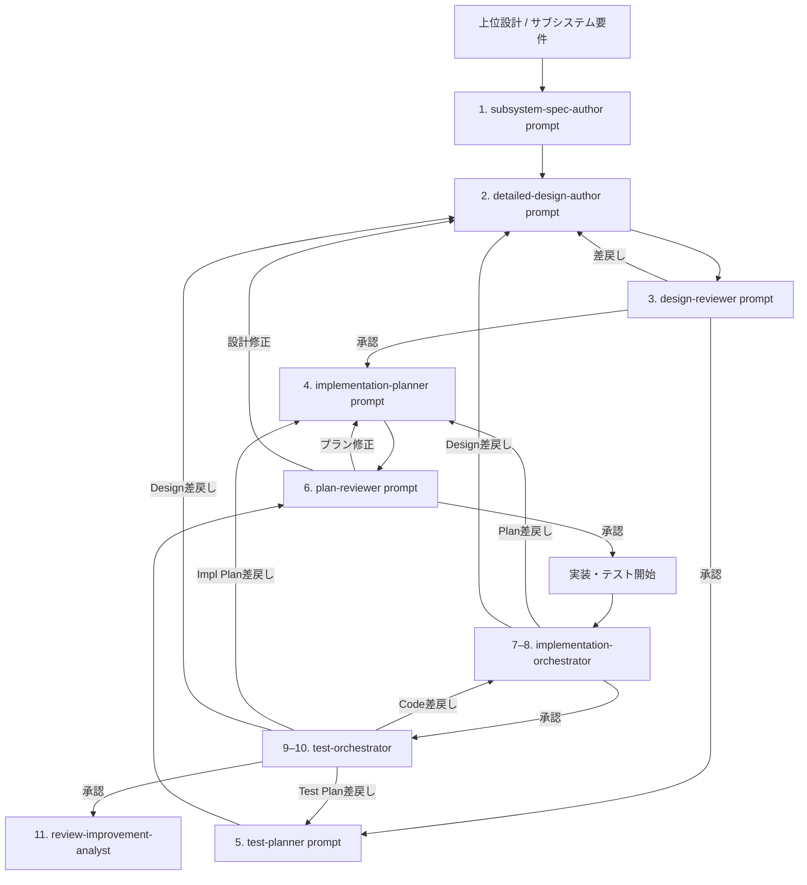
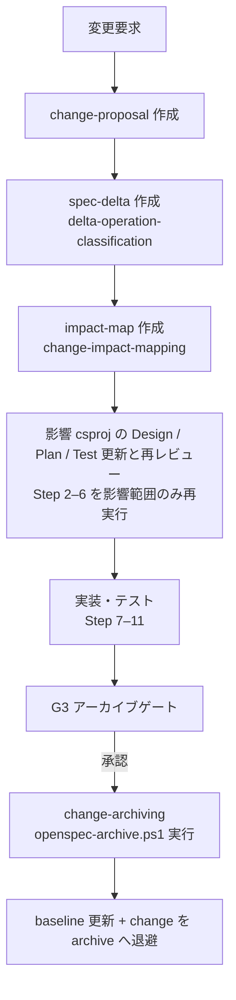

# OpenSpec ワークフローにおける skill / prompt 呼び出し順手順書

## 1. 目的

本書は、OpenSpec を正本とする Waterfall 寄りワークフローにおいて、どの phase でどの prompt と skill を使うかを 1 枚で確認できるようにするための運用手順書である。

本運用では、次の原則を採る。

- prompt は phase の主入口として使う
- skill は prompt 実行時の観点とチェックリストとして使う
- prompt は成果物作成またはゲートレビューを進める単位で呼ぶ
- skill 単独実行は、レビュー補助や再確認など限定用途にする

## 2. 全体フロー

## 3. 呼び出し順

### Step 1. サブシステム仕様作成

- 主 prompt: subsystem-spec-author
- 使う skill:
  - subsystem-requirements-refinement
  - acceptance-criteria-check
- 入力:
  - 上位設計のサブシステム要件
  - 制約
  - 非機能要件
- 出力:
  - Subsystem Spec
  - 要件 ID 付き要件一覧
  - 受け入れ条件
  - 未決事項
- 完了条件:
  - 要件 ID が一意
  - 各要件に受け入れ条件がある

### Step 2. 詳細設計書作成

- 主 prompt: detailed-design-author
- 使う skill:
  - detailed-design-authoring
  - traceability-mapping
- 入力:
  - 承認済みまたは作成済みの Subsystem Spec
  - 対象 csproj
- 出力:
  - Detailed Design
  - 要件 ID と設計要素 ID の対応表
  - クラス構成
  - アクティビティ図
  - エラー設計
  - テスト設計
- 完了条件:
  - すべての要件 ID が少なくとも 1 つの設計要素 ID に対応する
  - 実装順序や担当割りが設計書に入っていない

### Step 3. G1 設計レビュー

- 主 prompt: design-reviewer
- 使う skill:
  - design-gate-review
  - defect-classification
- 入力:
  - Subsystem Spec
  - Detailed Design
- 出力:
  - G1 レビュー記録
  - 指摘分類
  - 承認可否
- 判定:
  - 承認なら Step 4 へ進む
  - 設計差戻しなら Step 2 に戻る
  - 軽微修正なら修正反映後に完了扱いとする
- 確認ポイント:
  - 未トレース要件 ID が 0 件
  - 要件漏れ、責務分割不整合、図と本文の矛盾、エラー設計不足、テスト設計不足、テスタビリティ不足がない

### Step 4. 実装プラン作成

- 主 prompt: implementation-planner
- 使う skill:
  - implementation-plan-authoring
  - csproj-slicing
- 必要に応じて補助で使う skill:
  - traceability-mapping
- 入力:
  - 承認済み Detailed Design
  - 対象 csproj
- 出力:
  - Implementation Plan
  - plan item ID 付き作業分割
  - 実装順序
  - 環境準備
  - 要件 ID、設計要素 ID、プラン項目 ID の対応表
- 完了条件:
  - 各 plan item が requirement ID と design element ID を持つ
  - 設計判断を上書きしていない

### Step 5. テストプラン作成

- 主 prompt: test-planner
- 使う skill:
  - test-plan-authoring
  - traceability-mapping
- 必要に応じて補助で使う skill:
  - csproj-slicing
- 入力:
  - 承認済み Detailed Design
  - 対象 csproj
- 出力:
  - Test Plan
  - test ID 付きテスト作業分割
  - テスト順序
  - テストデータ、前提条件、環境準備
  - 要件 ID、設計要素 ID、テスト ID の対応表
- 完了条件:
  - 各 test item が requirement ID と design element ID を持つ
  - 設計判断を上書きしていない

### Step 6. G2 プランレビュー

- 主 prompt: plan-reviewer
- 使う skill:
  - plan-gate-review
  - return-target-classification
- 必要に応じて補助で使う skill:
  - defect-classification
  - traceability-mapping
- 入力:
  - 承認済み Detailed Design
  - Implementation Plan
  - Test Plan
- 出力:
  - G2 レビュー記録
  - 指摘分類
  - 承認可否
- 判定:
  - 承認なら実装・テスト開始
  - 実装プランの指摘なら Step 4 に戻る
  - テストプランの指摘なら Step 5 に戻る
  - 設計差戻し指摘なら Step 2 に戻り、設計修正後に影響範囲プランを更新して再度 Step 6 を実施する
  - 軽微修正なら修正反映後に完了扱いとする
- 確認ポイント:
  - 未トレース要件 ID が 0 件
  - 未トレース設計要素 ID が 0 件
  - プランが設計責務を壊していない

## 4. 実運用での使い分け

### 4.1 prompt を先に使う場面

- 新しい成果物を作るとき
- ゲートレビューを正式に実施するとき
- 出力形式をテンプレートに合わせたいとき

### 4.2 skill を単独で使う場面

- prompt 実行前に受け入れ条件だけを点検したいとき
- トレーサビリティ表だけを再点検したいとき
- レビュー指摘の戻し先だけを判定したいとき

## 5. 差戻し時の再実行ルール

| 差戻し種別 | 戻る先 | 再実行する prompt | 主に使う skill |
| --- | --- | --- | --- |
| 要件の曖昧さが原因 | Subsystem Spec | subsystem-spec-author | subsystem-requirements-refinement, acceptance-criteria-check |
| 設計構造の問題 | Detailed Design | detailed-design-author | detailed-design-authoring, traceability-mapping |
| 実装プランだけの問題 | Implementation Plan | implementation-planner | implementation-plan-authoring, csproj-slicing |
| テストプランだけの問題 | Test Plan | test-planner | test-plan-authoring, traceability-mapping |
| 実装結果の問題 | Implementation / Code | implementation-orchestrator または implementation-executor | implementation-review, implementation-execution-feedback-handling |
| テスト結果の問題 | Test / Code / Plan | test-orchestrator または test-executor または test-planner | test-review, test-execution-feedback-handling |
| 戻し先の判断に迷う | レビュー判定補助 | design-reviewer、plan-reviewer、implementation-reviewer、test-reviewer | defect-classification, return-target-classification |

## 6. 変更ライフサイクル（既存 baseline に対する仕様変更）

既存の baseline 仕様（`openspec/specs/subsystem-spec.md`）に対する変更は、baseline を直接書き換えず、`openspec/changes/<change-id>/` の薄い封筒として起案する。封筒には change-proposal、spec-delta、impact-map と reviews を置き、ゲート通過後に archive 操作で baseline へ畳み込む。

### 6.1 変更の流れ

### 6.2 変更起案で使う skill

| 成果物 | テンプレート | 使う skill | 主な確認点 |
| --- | --- | --- | --- |
| change-proposal | templates/change-proposal.md | （なし。提案の Why / Scope / 影響 csproj / ゲート状況を整理） | Change ID、Status、影響 csproj、承認 |
| spec-delta | templates/spec-delta.md | delta-operation-classification | Operation が ADDED / MODIFIED / REMOVED、baseline との ID 整合 |
| impact-map | templates/impact-map.md | change-impact-mapping | 全 delta 要件の対応、ID 参照のみ、再レビュー要否 |

### 6.3 影響範囲の再レビュー

- spec-delta と impact-map が確定したら、impact-map が指す csproj 成果物について Step 2〜6 を影響範囲のみ再実行する。
- ADDED / MODIFIED は対応する設計・プラン・テストを更新し、G1 / G2 を再通過させる。
- REMOVED は下流参照の除去を確認し、再レビュー対象として記録する。
- 影響しない csproj 成果物は据え置く。封筒は設計内容を複製せず、ID 参照のみを持つ。

### 6.4 G3 アーカイブゲート

- 全ゲート（G1 / G2 / 実装レビュー / テストレビュー）の承認後に実施する。
- change-archiving skill に従い、`scripts/openspec-archive.ps1 <change-id>` を明示実行する。
- スクリプトは proposal が Approved かつ spec-delta / impact-map が検証通過であることを確認し、baseline へ delta を畳み込み、`## Change History` を追記し、change フォルダを `openspec/changes/archive/<yyyymmdd>-<change-id>/` へ退避する。
- baseline はこのアーカイブ操作でのみ更新する。退避後の change フォルダは不変記録として編集しない。
- 詳細は [workflow-approval-gate-definition.md](../../../workflow-approval-gate-definition.md) の §14 / §15 を参照する。

## 7. 最短実行順

1. subsystem-spec-author
2. detailed-design-author
3. design-reviewer
4. implementation-planner
5. test-planner
6. plan-reviewer
7. implementation-executor
8. implementation-reviewer
9. test-executor
10. test-reviewer
11. review-improvement-analyst

この 11 個を主経路とし、各 phase の内部で必要な skill を適用する。