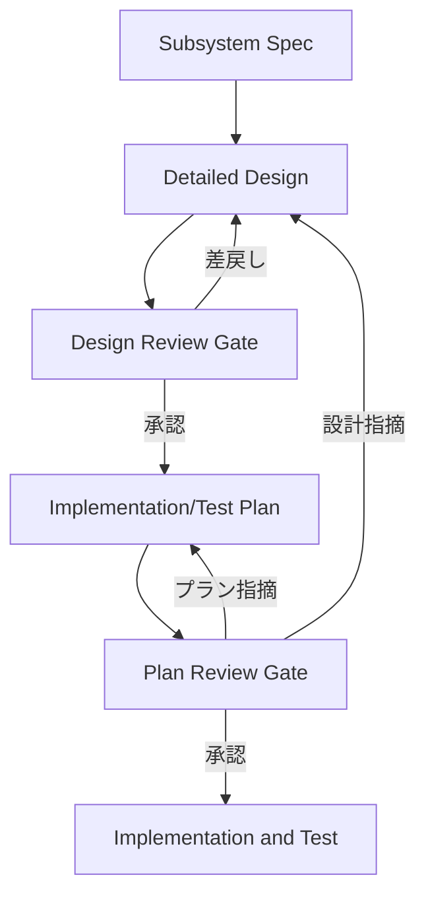

# OpenSpec 改修方針設計書

## 1. 目的

本書は、OpenSpec を仕様の正本として維持しつつ、Waterfall 寄りの厳密な工程管理を実現するための改修方針を定義する。

本方針では、Superpowers の TDD 的な進め方は採用せず、skill ベースの考え方から以下のみを取り入れる。

- 工程分離
- 成果物ごとの責務明確化
- レビューによる承認ゲート
- 指摘の戻し先の明確化

## 2. 改修方針の要約

OpenSpec には、既存の仕様管理に加えて以下の phase を明示的に追加する。

1. Subsystem Spec
2. Detailed Design
3. Design Review Gate
4. Implementation/Test Plan
5. Plan Review Gate

この 5 phase により、仕様、設計、計画、承認を分離し、実装開始前に設計とプランの両方を承認済みにする。

## 3. 設計原則

1. OpenSpec は仕様の唯一の正本とする。
2. 詳細設計書は、仕様をクラス構成、アクティビティ図、エラー設計、テスト設計へ落とし込む成果物とする。
3. 実装・テストプランは、設計を変更せずに実行可能な計画へ変換する成果物とする。
4. 要件には一意の要件 ID を付与し、下流成果物は要件 ID を基点に機械的にトレーサビリティを取る。
5. レビュー指摘は「設計へ戻す」「プランで閉じる」「軽微修正」に分類する。
6. G1 と G2 の承認ゲートを通過するまでは実装・テストへ進まない。

## 4. 要件 ID ベースのトレーサビリティ方針

### 4.1 基本方針

- OpenSpec 上の各要件には一意の要件 ID を付与する
- 詳細設計書、実装・テストプラン、テストケース、レビュー記録は要件 ID を必須項目として保持する
- 要件 ID をキーに、要件から設計、プラン、テスト、レビュー指摘まで追跡できる構造を維持する
- 要件の意味が変わる変更は既存 ID を流用せず、新しい要件 ID を採番する
- 廃止要件は削除せず、廃止状態として履歴を保持する

### 4.2 ID 体系

最低限、以下の ID を管理対象とする。

- 要件 ID: REQ-xxx
- 設計要素 ID: DSG-xxx
- エラー設計 ID: ERR-xxx
- テストケース ID: TST-xxx
- プラン項目 ID: PLN-xxx
- レビュー指摘 ID: REV-xxx

必要に応じて、サブシステム識別子や csproj 識別子を接頭辞に含める。

例:

- AUTH-REQ-001
- AUTH-DSG-003
- AUTH-PLN-007

### 4.3 必須トレーサビリティ

少なくとも次の対応を機械的に追跡可能にする。

- REQ -> DSG
- REQ -> PLN
- REQ -> TST
- REV -> REQ
- REV -> DSG または PLN

### 4.4 成果物ごとの必須記載項目

#### Subsystem Spec

- 要件 ID
- 要件本文
- 受け入れ条件
- 状態

#### Detailed Design

- 設計要素 ID
- 対応する要件 ID
- クラス構成または図表との対応

#### Implementation/Test Plan

- プラン項目 ID
- 対応する要件 ID
- 対応する設計要素 ID

#### Test Design / Test Case

- テストケース ID
- 検証対象の要件 ID
- 検証対象の設計要素 ID

#### Review Record

- 指摘 ID
- 影響する要件 ID
- 影響する設計要素 ID またはプラン項目 ID

### 4.5 承認ゲートへの影響

- G1 では、未トレース要件 ID が 0 件であることを承認条件に含める
- G2 では、未トレース要件 ID と未トレース設計要素 ID が 0 件であることを承認条件に含める
- レビュー指摘には必ず要件 ID を紐付け、影響範囲の機械的抽出を可能にする

## 5. Phase 構成

### 5.1 Subsystem Spec

#### 目的

上位設計で定義したサブシステムの要件、境界、受け入れ条件、変更履歴を管理する。

#### 出力

- サブシステム仕様
- システム境界
- 受け入れ条件
- 未決事項

### 5.2 Detailed Design

#### 目的

Subsystem Spec を基に、csproj 単位の詳細設計書を作成する。

#### 出力

- クラス構成
- アクターがクラスレベルの単位で分割されたアクティビティ図
- エラー設計
- テスト設計
- 要件と設計要素の対応表

### 5.3 Design Review Gate

#### 目的

詳細設計書が仕様を漏れなく表現しているかを判定し、設計へ戻す指摘か軽微修正かを確定する。

#### 出力

- 設計レビュー記録
- 指摘分類
- 承認可否

### 5.4 Implementation/Test Plan

#### 目的

承認済みの詳細設計書を基に、csproj 単位の実装・テストプランを作成する。

#### 出力

- 実装順序
- 作業分割
- テスト実行順序
- 環境準備
- 設計とのトレーサビリティ

### 5.5 Plan Review Gate

#### 目的

実装・テストプランが設計を正しく具体化しているかを判定し、プランで閉じる指摘と設計へ戻す指摘を確定する。

#### 出力

- プランレビュー記録
- 指摘分類
- 承認可否

## 6. skill・prompt・custom agent 割り当て方針

本方針では、各 phase に対して次の役割分担を採る。

- skill: 観点とチェックリストを固定する
- prompt: 入力と出力の形式を固定する
- custom agent: 成果物作成または判定の責務を固定する

### 6.1 割り当て一覧

| Phase | skill | prompt | custom agent | 主責務 |
| --- | --- | --- | --- | --- |
| Subsystem Spec | subsystem-requirements-refinement, acceptance-criteria-check | subsystem-spec-author.prompt.md | subsystem-spec-author.agent.md | サブシステム要件を漏れなく仕様化する |
| Detailed Design | detailed-design-authoring, traceability-mapping | detailed-design-author.prompt.md | detailed-design-author.agent.md | クラス構成、アクティビティ図、エラー設計、テスト設計を作成する |
| Design Review Gate | design-gate-review, defect-classification | design-reviewer.prompt.md | design-reviewer.agent.md | 設計へ戻す指摘と軽微修正を判定する |
| Implementation/Test Plan | implementation-plan-authoring, csproj-slicing | implementation-planner.prompt.md | implementation-planner.agent.md | 設計を変更せず csproj 単位の実行計画へ落とす |
| Plan Review Gate | plan-gate-review, return-target-classification | plan-reviewer.prompt.md | plan-reviewer.agent.md | プラン内で閉じる指摘と設計へ戻す指摘を判定する |

### 6.2 各 custom agent の責務と禁止事項

#### subsystem-spec-author.agent.md

- 責務: 上位設計で定義したサブシステム要件を OpenSpec の仕様へ整形する
- 禁止: クラス設計、実装順序、担当割りへの踏み込み

#### detailed-design-author.agent.md

- 責務: 承認済み仕様を詳細設計書へ落とし込む
- 禁止: 実装順序、工数、担当割りの決定

#### design-reviewer.agent.md

- 責務: 詳細設計書が仕様を満たしているか、設計として妥当かを判定する
- 禁止: プラン修正で閉じるべき指摘を設計差戻しにすること

#### implementation-planner.agent.md

- 責務: 承認済み設計を実行可能な csproj 単位のプランへ変換する
- 禁止: 設計判断の上書き

#### plan-reviewer.agent.md

- 責務: プランの実行性と設計トレーサビリティを判定する
- 禁止: 設計変更をプラン修正だけで済ませること

## 7. prompt 設計方針

### 7.1 subsystem-spec-author.prompt.md

#### 入力

- 上位設計のサブシステム要件
- 制約
- 非機能要件

#### 出力

- OpenSpec 用のサブシステム仕様
- 境界定義
- 受け入れ条件
- 未決事項

### 7.2 detailed-design-author.prompt.md

#### 入力

- 承認済み Subsystem Spec

#### 出力

- クラス構成
- アクティビティ図
- エラー設計
- テスト設計
- 要件対応表
- 要件 ID と設計要素 ID の対応表

### 7.3 design-reviewer.prompt.md

#### 入力

- Subsystem Spec
- 詳細設計書

#### 出力

- 指摘一覧
- 指摘分類
- 軽微修正判定
- 影響する要件 ID
- 承認可否

### 7.4 implementation-planner.prompt.md

#### 入力

- 承認済み詳細設計書

#### 出力

- csproj 単位の実装順序
- テスト順序
- 作業分割
- 環境準備
- トレーサビリティ
- 要件 ID、設計要素 ID、プラン項目 ID の対応表

### 7.5 plan-reviewer.prompt.md

#### 入力

- 承認済み詳細設計書
- 実装・テストプラン

#### 出力

- 指摘一覧
- 設計差戻し判定またはプラン内解決判定
- 影響する要件 ID
- 承認可否

## 8. ワークフロー定義



## 9. 承認ゲートへの組み込み方針

### 9.1 Design Review Gate

必須判定項目:

- 要件漏れ・要件解釈の誤り
- 要件 ID が一意であること
- 未トレース要件 ID が存在しないこと
- 責務分割・クラス構成の不整合
- アクティビティ図と本文の矛盾
- エラー設計の不足・矛盾
- テスト設計の不足・矛盾
- テスタビリティの不足

上記に該当する指摘は、必ず Detailed Design へ差し戻す。

### 9.2 Plan Review Gate

必須判定項目:

- 実装順序の妥当性
- テスト実行順と環境準備の妥当性
- 作業粒度の妥当性
- csproj 単位の担当割り当てと並行実行計画
- 設計トレーサビリティの明示
- 未トレース要件 ID が存在しないこと
- 未トレース設計要素 ID が存在しないこと

ただし、以下に該当する指摘はプラン内で閉じてはならず、Detailed Design へ差し戻す。

- 要件漏れ・要件解釈の誤り
- 責務分割・クラス構成の不整合
- アクティビティ図と本文の矛盾
- エラー設計の不足・矛盾
- テスト設計の不足・矛盾
- テスタビリティの不足

## 10. テンプレートと配置方針

以下のように、成果物と運用資産を分離して配置する。

```text
workflow/
  phases/
  gates/
specs/
  subsystem/
designs/
  detailed/
plans/
  implementation-test/
reviews/
  design/
  plan/
.github/
  prompts/
  agents/
  skills/
templates/
```

### 10.1 templates 配下の対象

- subsystem-spec.md
- detailed-design.md
- implementation-test-plan.md
- review-record.md

### 10.2 .github/prompts 配下の対象

- subsystem-spec-author.prompt.md
- detailed-design-author.prompt.md
- design-reviewer.prompt.md
- implementation-planner.prompt.md
- plan-reviewer.prompt.md

### 10.3 .github/agents 配下の対象

- subsystem-spec-author.agent.md
- detailed-design-author.agent.md
- design-reviewer.agent.md
- implementation-planner.agent.md
- plan-reviewer.agent.md

### 10.4 .github/skills 配下の対象

- subsystem-requirements-refinement/SKILL.md
- acceptance-criteria-check/SKILL.md
- detailed-design-authoring/SKILL.md
- traceability-mapping/SKILL.md
- design-gate-review/SKILL.md
- defect-classification/SKILL.md
- implementation-plan-authoring/SKILL.md
- csproj-slicing/SKILL.md
- plan-gate-review/SKILL.md
- return-target-classification/SKILL.md

## 11. 改修の優先順位

1. workflow と gates の定義追加
2. templates に要件 ID と関連 ID の欄を追加
3. prompts の整備
4. custom agents の整備
5. 実運用でのレビュー記録様式とトレーサビリティ確認手順の確定

## 12. 推奨する改修の着地

OpenSpec の改修は、ツール本体の大規模変更ではなく、運用資産の拡張として実施するのが望ましい。これにより、OpenSpec 本来の継続的な仕様管理の強みを保ったまま、Waterfall 寄りの設計・承認フローを追加できる。

最終的な着地点は次の状態である。

- OpenSpec がサブシステム仕様の正本として運用されている
- 詳細設計書と実装・テストプランが phase として独立管理されている
- G1 と G2 の承認ゲートが明文化されている
- 要件 ID を基点に未トレース要件を機械的に検出できる
- 各 phase に対応する skill、prompt、custom agent が固定されている
- 指摘の戻し先がレビュー時に迷わない粒度で定義されている