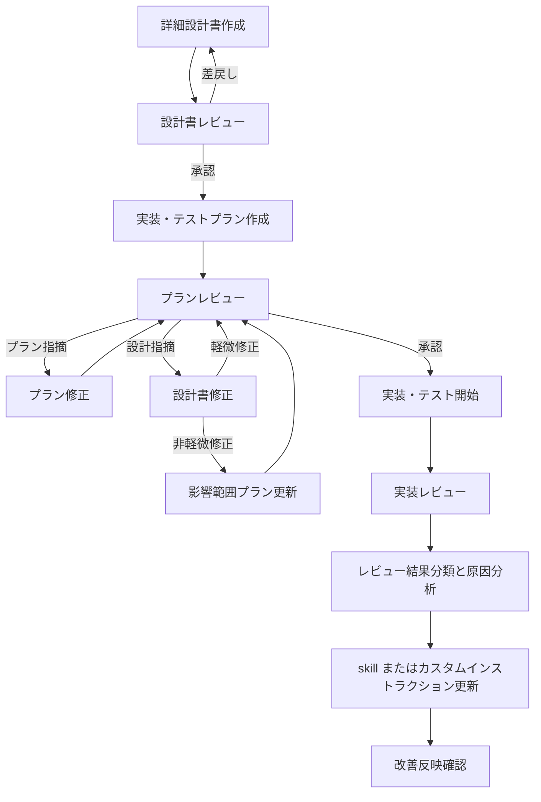

# OpenSpec ワークフロー&承認ゲート定義書

## 1. 目的

本書は、OpenSpec を仕様の正本として運用し、Superpowers の skill ベースの考え方から「工程分離」「成果物ごとの責務明確化」「レビューによる承認ゲート」だけを取り入れるための定義書である。

本運用の目的は次のとおり。

- 上位設計で定義したサブシステム要件を起点に、詳細設計書を厳密に作成する
- csproj 単位で実装・テストプランを作成し、設計と分離してレビューする
- 指摘を「設計へ戻すべきもの」と「プラン内で閉じるもの」に分類し、差し戻し先を明確化する
- 設計完了前に実装へ進まない Waterfall 寄りの統制を維持する

## 2. 適用範囲

本書は、以下の成果物に適用する。

1. OpenSpec 上の仕様
2. csproj 単位の詳細設計書
3. csproj 単位の実装・テストプラン
4. レビュー記録および承認記録
5. 実装レビュー結果の分析記録と改善記録

## 3. 成果物の責務

### 3.1 OpenSpec

- サブシステムの要件
- システム境界
- 受け入れ条件
- 変更履歴

### 3.2 詳細設計書

- クラス構成
- アクターがクラスレベルの単位で分割されたアクティビティ図
- エラー設計
- テスト設計
- 要件と設計要素の対応

### 3.3 実装・テストプラン

- 実装順序
- csproj 単位の作業分割
- テスト実行順序
- 環境準備
- 設計とのトレーサビリティ

### 3.4 実装レビュー結果の分析記録と改善記録

- 実装レビュー結果の原因分類
- 頻出するミスの傾向整理
- 改善対象とする skill またはカスタムインストラクションの特定
- 改善内容と根拠レビュー ID の対応

## 4. 基本原則

1. 実装・テストプランは、設計を具体化するものであり、設計を上書きしてはならない。
2. 実装・テストプランのレビューで設計上の問題が見つかった場合は、設計書へ差し戻す。
3. OpenSpec 上の各要件には一意の要件 ID を付与し、詳細設計書、実装・テストプラン、テスト設計、レビュー記録へ引き継ぐ。
4. 設計書の軽微修正を除き、設計変更が発生した場合は、影響範囲のプランを再レビューする。
5. 誤字脱字、図表レイアウト、参照リンクや章番号の修正のみを軽微修正とする。
6. 承認ゲートを通過するまでは、次工程へ進まない。
7. 実装レビュー完了後は、レビュー結果を分類し、再発防止のために skill またはカスタムインストラクションの改善要否を判定する。

## 5. 要件 ID ベースのトレーサビリティ規則

### 5.1 目的

要件から設計、プラン、テスト、レビュー指摘までを機械的に追跡し、未対応要件や影響範囲を自動的に検出しやすくする。

### 5.2 規則

- OpenSpec の各要件には一意の要件 ID を付与する
- 詳細設計書の各設計要素には、対応する要件 ID を記載する
- 実装・テストプランの各項目には、対応する要件 ID と設計要素 ID を記載する
- テスト設計とテストケースには、検証対象の要件 ID を記載する
- レビュー指摘には、影響する要件 ID を必ず記録する
- 改善記録には、根拠となるレビュー指摘 ID と更新対象ファイルを記録する

### 5.3 最低限追跡する対応関係

- REQ -> DSG
- REQ -> PLN
- REQ -> TST
- REV -> REQ
- REV -> DSG または PLN

### 5.4 自動トレーサビリティ検証

- workspace hook は [.github/hooks/traceability-check.json](.github/hooks/traceability-check.json) から [scripts/traceability-hook.ps1](scripts/traceability-hook.ps1) を PostToolUse で実行する
- hook は Subsystem Spec、Detailed Design、Implementation/Test Plan の Markdown を対象に機械的検証を行う
- hook は定義表内の ID 重複を失敗とする
- hook は Detailed Design の Traceability Summary で未トレース要件 ID を失敗とする
- hook は Implementation/Test Plan の Traceability Matrix で要件 ID または設計要素 ID が空の plan item を失敗とする

## 6. 指摘の分類基準

### 6.1 設計書へ戻す指摘

以下の指摘は、実装・テストプラン内では閉じず、詳細設計書へ差し戻す。

| 指摘分類 | 判定基準 | 処置 |
| --- | --- | --- |
| 要件漏れ・要件解釈の誤り | サブシステムが満たすべき要件が設計へ反映されていない、または解釈が誤っている | 設計書修正後、影響範囲のプランを更新して再レビュー |
| 責務分割・クラス構成の不整合 | クラス境界、責務、依存方向、アクター分割が妥当でない | 設計書修正後、影響範囲のプランを更新して再レビュー |
| アクティビティ図と設計本文の矛盾 | 処理手順、分岐、呼び出し主体が一致しない | 設計書修正後、影響範囲のプランを更新して再レビュー |
| エラー設計の不足・矛盾 | 異常系、例外方針、復旧方針の記述が不足または矛盾している | 設計書修正後、影響範囲のプランを更新して再レビュー |
| テスト設計の不足・矛盾 | 観点、ケース、期待結果が設計として不十分 | 設計書修正後、影響範囲のプランを更新して再レビュー |
| テスタビリティの不足 | クラス分割、依存方向、観測点不足によりテスト成立性が低い | 設計書修正後、影響範囲のプランを更新して再レビュー |

### 6.2 プラン内で閉じる指摘

以下の指摘は、設計書へ戻さず、実装・テストプランの修正だけで閉じる。

| 指摘分類 | 判定基準 | 処置 |
| --- | --- | --- |
| 実装順序の組み替え | 依存関係や段取りの見直しで解決できる | プラン修正後にプラン再レビュー |
| テスト実行順・環境準備の不足 | 検証順序、テストデータ、前提条件の追記で解決できる | プラン修正後にプラン再レビュー |
| 作業粒度の粗さ・細かさ | タスク分割や見積り粒度の調整で解決できる | プラン修正後にプラン再レビュー |
| csproj 単位の担当割り当て・並行実行計画 | 担当や作業順の調整で解決できる | プラン修正後にプラン再レビュー |
| 設計トレーサビリティの記述不足 | 設計との対応表や参照先の明記で解決できる | プラン修正後にプラン再レビュー |

### 6.3 軽微修正として扱う指摘

以下はレビュー不要の軽微修正とする。

- 誤字脱字・表現修正のみ
- 図表のレイアウト調整のみ
- 参照リンクや章番号の修正のみ

以下は軽微修正としない。

- クラス名・メソッド名の変更
- テスト観点の追加・削除
- エラー条件や分岐条件の変更

## 7. ワークフロー

## 8. 承認ゲート定義

### G1. 設計書レビューゲート

#### 入力

- OpenSpec 上の対象仕様
- 対象 csproj の詳細設計書

#### 確認項目

- 要件が漏れなく設計へ落ちているか
- 要件 ID が一意であり、未トレース要件 ID が存在しないか
- クラス構成、責務分割、依存方向が妥当か
- アクター分割されたアクティビティ図と本文が整合しているか
- エラー設計が正常系と異常系を十分に表しているか
- テスト設計が要求検証に耐えるか
- テスタビリティが担保されているか

#### 承認条件

- 設計へ戻す指摘が 0 件であること
- 未トレース要件 ID が 0 件であること
- 軽微修正のみであること、または修正が完了していること

#### 差戻し条件

- 6.1 に該当する指摘が 1 件でもあること
- または未トレース要件 ID が 1 件でもあること

### G2. プランレビューゲート

#### 入力

- 承認済みの詳細設計書
- 対象 csproj の実装・テストプラン

#### 確認項目

- プランが設計の責務分割を保っているか
- 実装順序が依存関係に沿っているか
- テスト実行順序と環境準備が妥当か
- 作業粒度が実行可能なレベルに分解されているか
- csproj 単位の分担と並行実行計画が妥当か
- 設計とのトレーサビリティが明示されているか
- 未トレース要件 ID と未トレース設計要素 ID が存在しないか

#### 承認条件

- 設計へ戻す指摘が 0 件であること
- 未トレース要件 ID が 0 件であること
- 未トレース設計要素 ID が 0 件であること
- プラン内で閉じる指摘が解消済みであること
- 軽微修正があれば反映済みであること

#### 差戻し条件

- 6.1 に該当する指摘が含まれること
- または 6.2 に該当する未解消の指摘が残っていること
- または未トレース要件 ID か未トレース設計要素 ID が 1 件でもあること

## 9. 再レビュー規則

1. プラン内で閉じる指摘は、プラン修正後に G2 を再実施する。
2. 設計書に戻る指摘は、設計書修正後に影響範囲のプランを更新し、G2 を再実施する。
3. 軽微修正だけであれば、再レビューは不要とする。
4. 軽微修正以外の設計変更は、影響範囲のみを再レビュー対象とする。

## 10. レビュー記録の必須項目

各レビュー指摘には、少なくとも以下を記録する。

- 指摘 ID
- 影響する要件 ID
- 対象成果物
- 対象 csproj
- 指摘分類
- 指摘内容
- 戻し先
- 原因分類
- 根本原因
- 修正担当
- 修正結果
- 再レビュー要否

## 11. 運用上の判断ルール

レビュー時に戻し先で迷った場合は、以下の順で判断する。

1. その指摘は要件の満たし方を変えるか
2. その指摘はクラス責務、アクター分割、処理手順、異常系、テスト観点を変えるか
3. その指摘は作業順序、担当割り、粒度、環境準備、参照補足だけで解決できるか

1 または 2 に該当すれば設計書へ戻す。3 のみで解決できる場合はプラン内で閉じる。

## 12. 実装完了後の継続改善プロセス

1. 実装レビュー完了後に、対象のレビュー記録を収集する。
2. 各指摘を、要件読解不足、トレーサビリティ記載漏れ、戻し先判定誤り、工程逸脱、出力形式不整合、レビュー観点漏れなどの原因分類へ正規化する。
3. 頻度と重大度を集計し、表面的な指摘内容ではなく根本原因を特定する。
4. 根本原因が工程固有の手順不足であれば workspace skill を更新対象とし、横断的な既定動作の不足であれば workspace custom instructions を更新対象とする。
5. 一回限りの局所不具合で再利用価値が低い場合は、成果物修正で閉じ、skill や custom instructions には反映しない。
6. 改善分析には [.github/skills/review-driven-improvement/SKILL.md](.github/skills/review-driven-improvement/SKILL.md) を用い、必要に応じて [.github/agents/review-improvement-analyst.agent.md](.github/agents/review-improvement-analyst.agent.md) で分類と改善案の整理を行う。
7. custom instructions の更新先が未作成であれば、.github/copilot-instructions.md または .github/instructions/*.instructions.md を新規作成対象として扱う。
8. 改善後は、関連する agent、skill、instructions の整合性を確認し、同一ルールの重複記載を避ける。

## 13. 本定義の採用方針

本ワークフローでは、OpenSpec を仕様の唯一の正本とし、詳細設計書と実装・テストプランをレビューゲートによって厳密に接続する。これにより、Superpowers の TDD 的な進め方を採らずとも、skill ベースの考え方だけを工程管理へ取り込み、Waterfall 寄りの運用を維持できる。